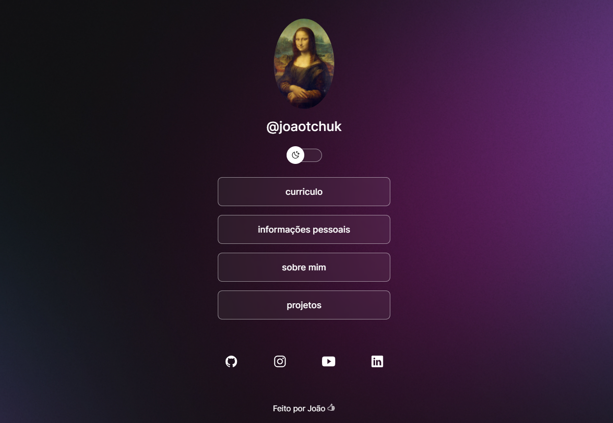

<h1 align="center"> Social Links </h1>

Projeto realizado para facilitar as apresentações online.  

  
  &nbsp;&nbsp;&nbsp;|&nbsp;&nbsp;&nbsp;
  <a href="#-tecnologias">Tecnologias</a>&nbsp;&nbsp;&nbsp;|&nbsp;&nbsp;&nbsp;
  <a href="#-projeto">Projeto</a>&nbsp;&nbsp;&nbsp;|&nbsp;&nbsp;&nbsp;
  <a href="#-layout">Layout</a>&nbsp;&nbsp;&nbsp;|&nbsp;&nbsp;&nbsp;

 

  

## 🚀 Tecnologias

Esse projeto foi desenvolvido com as seguintes tecnologias:

- HTML e CSS
- JavaScript
- Git e Github
- Figma

## 💻 Projeto

O Projeto "Social Link" é um agregador de links para usar como cartão de visitas online.

- [Acesse o projeto finalizado, online](https://joaotchuk.github.io/projeto-perfil/)

## 🔖 Layout

As imagens desse projeto foram utilizadas través [DESSE LINK](https://www.figma.com/community/file/1187422022288947321). (É necessário ter conta no [Figma](https://figma.com) para acessá-lo).

